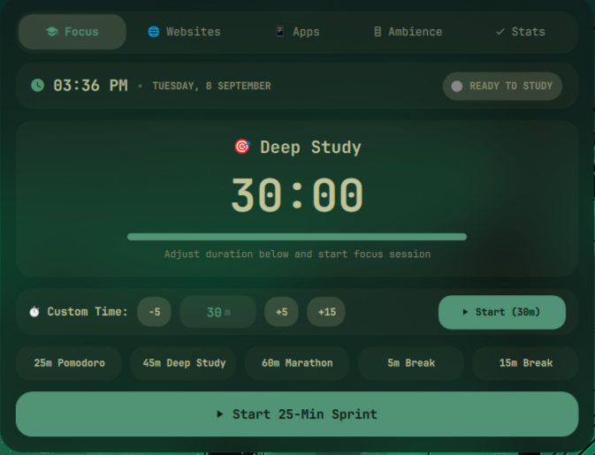
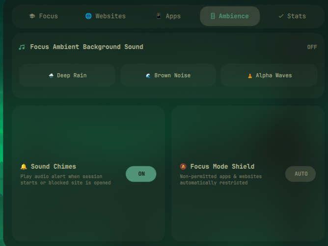
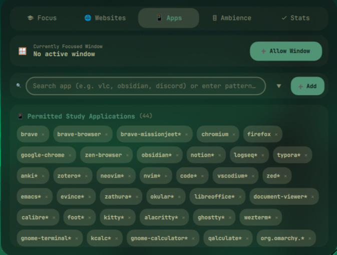
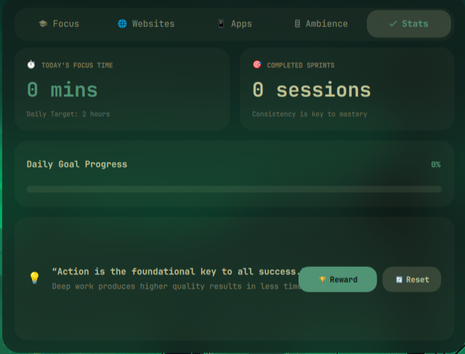
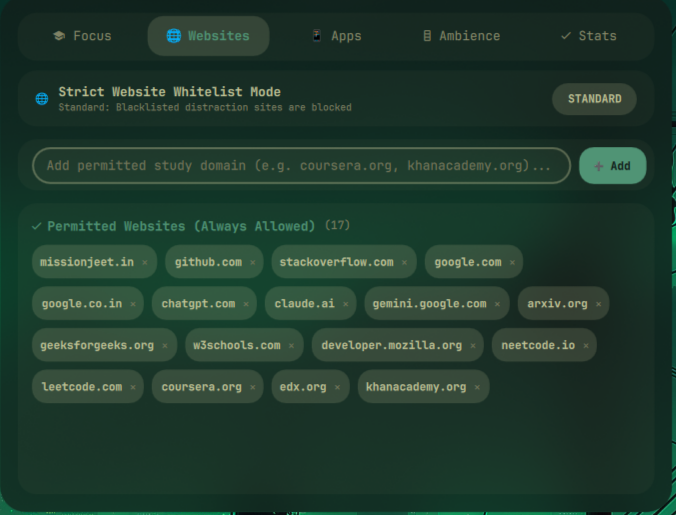

# Focus Hub (`omarchy-focus-hub`)

> **Unofficial / Community Plugin**: An independent open-source study and focus assistant for Omarchy.

An Omarchy plugin providing a Quickshell-integrated Pomodoro session controller, ambient sound generator, session statistics tracker, and optional distraction limiter — all visible from the Omarchy top bar.

This project was developed through an AI-assisted workflow. The concept, customization, configuration, testing, integration, and final iteration were directed and carried out by me.

---

## My Contribution

I did not write Omarchy, Quickshell, or Hyprland from scratch. What I contributed:

- **Plugin Architecture**: Designed and structured this as a conformant Omarchy plugin with `manifest.json`, `BarWidget.qml`, and `FocusDashboard.qml` following the Omarchy plugin system conventions.
- **Bar Widget**: Designed and implemented `BarWidget.qml` showing the active timer countdown and session status in the Omarchy top bar.
- **Focus Dashboard UI**: Designed and built `FocusDashboard.qml` — the expandable full panel with Pomodoro controls, ambient sound selector, session statistics, and distraction restriction toggles.
- **Pomodoro Engine**: Configured and scripted the focus/break interval system with configurable durations, desktop notifications, and progress ring animation.
- **Ambient Sound System**: Integrated ambient audio playback (rain, white noise, cafe) via `mpv` or `paplay`, configurable via `sounds/` directory.
- **Session Statistics**: Designed streak tracking, session counters, and celebration animation logic.
- **Optional Distraction Controls**: Implemented the opt-in app restriction and tab-level website notice system, strictly user-session-level with a "allow for 5 minutes" bypass.
- **Configuration Format**: Designed `study-mode.json` for storing timer presets and restriction lists.
- **Installer**: Authored `./install.sh` for safe user-scope deployment.
- **Documentation**: Wrote all usage, configuration, and troubleshooting docs.
- **Testing**: Tested on Omarchy 4.0.2 / Quickshell 0.3.1 / Hyprland 0.56.2.

---

## Based On / Credits

- **[Omarchy](https://github.com/basecamp/omarchy)** — The open-source Arch Linux desktop environment and plugin system by Basecamp. This plugin uses the Omarchy plugin manifest format and bar widget API.
- **[Quickshell](https://quickshell.outfoxxed.me)** — The Qt6 QML Wayland layer-shell desktop shell that renders the bar widget and dashboard panel.
- **[Hyprland](https://hyprland.org)** — The Wayland tiling compositor.
- **[mpv](https://mpv.io)** — Used optionally for ambient sound playback.

**Related Repos**:
- [omarchy-system-pulse](https://github.com/aarushdalal/omarchy-system-pulse) — System telemetry and hardware dashboard
- [omarchy-cloud-sync](https://github.com/aarushdalal/omarchy-cloud-sync) — Cloud backup dashboard
- [omarchy-config-time-machine](https://github.com/aarushdalal/omarchy-config-time-machine) — Configuration snapshot system
- [omarchy-screensaver-studio](https://github.com/aarushdalal/omarchy-screensaver-studio) — Multi-mode screensaver engine

---

## Plugin Manifest

This repository includes a valid `manifest.json` for the Omarchy plugin system:

```json
{
  "schemaVersion": 1,
  "id": "daemon0.focus-hub",
  "name": "Focus Hub",
  "version": "1.0.0",
  "author": "Daemon0",
  "description": "Interactive study session controller, focus timer, and optional distraction manager",
  "kinds": ["bar-widget"],
  "entryPoints": { "barWidget": "BarWidget.qml" },
  "barWidget": {
    "displayName": "Focus Hub",
    "category": "Productivity",
    "allowMultiple": false,
    "defaultSection": "right"
  }
}
```

---

## Features

- **Pomodoro Timer**: Configurable focus, short break, and long break intervals with desktop notifications and progress ring.
- **Ambient Sound Generator**: Built-in audio tracks (rain, white noise, cafe) for concentration.
- **Session Statistics & Rewards**: Streak tracking, completed session counts, and celebration animations.
- **Optional App & Website Distraction Controls**:
  - Restrict specified application launches during focus intervals.
  - Tab-level website notice when navigating to configured distraction domains.
  - Quick "allow for 5 minutes" bypass for urgent tasks.

> **Note**: Focus restrictions are productivity tools, **not a security boundary**. The distraction limiter operates at the user session level to assist in habit building. It never silently terminates user applications without notice and all domain/process blocking is strictly **opt-in**.

---

## Requirements

- **Operating System**: Arch Linux (rolling release, x86_64)
- **Desktop Shell**: Omarchy (`dev (13f18b2c) / 4.0.2`) with Quickshell (`0.3.1`)
- **Compositor**: Hyprland (`0.56.2`)
- **Core Dependencies**: `python3`, `bash`, `jq`
- **Optional**: `mpv` or `paplay` (for ambient sound and celebration chimes)

---

## Compatibility

| Component | Tested Version | Compatibility Status |
|---|---|---|
| Omarchy | `dev (13f18b2c) / 4.0.2` | Fully compatible |
| Quickshell | `0.3.1` | Fully compatible |
| Hyprland | `0.56.2` | Fully compatible |

---

## Installation

### Method 1: Using Omarchy Plugin Manager (Recommended)

```bash
omarchy plugin add https://github.com/aarushdalal/omarchy-focus-hub.git --enable
```

### Method 2: Using the Safe User Installer

```bash
git clone https://github.com/aarushdalal/omarchy-focus-hub.git
cd omarchy-focus-hub

./install.sh check
./install.sh install --dry-run
./install.sh install
```

---

## System Setup Before Installation

1. Copy the example configuration template:
   ```bash
   mkdir -p ~/.config/omarchy
   cp examples/study-mode.example.json ~/.config/omarchy/study-mode.json
   ```
2. Ensure a notification daemon (`dunst`, `mako`, or Omarchy notification service) is running.

---

## Usage

- **Bar Widget**: Shows active timer countdown and session status in the Omarchy top bar.
- **CLI Commands**:
  ```bash
  omarchy-focus-hub start 25 "Deep Work"   # Start a 25-minute focus interval
  omarchy-focus-hub break 5               # Start a 5-minute break
  omarchy-focus-hub stop                  # End session
  omarchy-focus-hub status                # Check active timer state
  ```

---

## Configuration

Stored in `~/.config/omarchy/study-mode.json`:

```json
{
  "timer": {
    "focus_minutes": 25,
    "short_break_minutes": 5,
    "long_break_minutes": 15
  },
  "restrictions": {
    "block_distractions": false,
    "blocked_binaries": ["steam", "discord"]
  }
}
```

---

## Update

```bash
omarchy plugin update daemon0.focus-hub
```

---

## Uninstall

```bash
./install.sh uninstall
# Or:
omarchy plugin remove daemon0.focus-hub --yes
```

---

## Security and Privacy

- No personal browsing history or site databases are collected, stored, or sent anywhere.
- Whitelists and blacklists are stored purely locally in plain JSON.

---

## Showcase







---

## Contributing

Pull requests are welcome!

---

## License

This project is licensed under the [MIT License](LICENSE).

---

## Credits / Third-Party Notices

- Built for the [Omarchy](https://github.com/basecamp/omarchy) desktop environment.
- Powered by [Quickshell](https://quickshell.outfoxxed.me/) and [Hyprland](https://hyprland.org/).
- Not an official Omarchy product.
